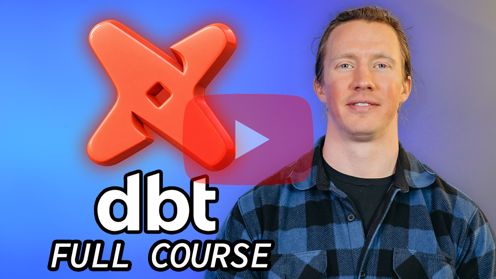

# 🔧 dbt for Data Analysts & Engineers - Full Course

Data Nerds! This repo contains all the files needed to follow along my free course: dbt for Data Analysts & Engineers <!-- TODO: course link + thumbnail badge at launch -->



## Team Members 👥

**🙋🏼‍♂️ Course Leader:** [Luke Barousse](https://www.linkedin.com/in/luke-b)

**📺 Video Editor:** [Brannon Linder](https://www.linkedin.com/in/brannonlinder)
<!-- TODO: producer / content developer at launch -->

## What this course covers

You already know SQL. This course teaches you to turn scattered SQL scripts into a tested, documented, version-controlled data pipeline with dbt. It's the **T in ELT**: data engineers extract and load the raw data (that part already happened); analytics engineers transform it inside the warehouse. That's the job this course trains.

You'll build **two portfolio projects**: a local, tested, automated job-market pipeline on DuckDB (published with GitHub Actions), then a production-grade rebuild on Databricks — a year of real job postings (~692k rows) from raw files to a documented star schema.

## What's in this repo

Lesson notes live in the course itself — this repo holds the code:

| Folder | What it is |
| --- | --- |
| [project_1/](project_1/) | Reference implementation of Project #1 (dbt + DuckDB, the finished repo you build in the course) |
| [project_2/](project_2/) | Reference implementation of Project #2 (dbt + Databricks) |
| `project_*/snippets/` | Files the videos hand out via `lukeb.co` short links, frozen at the lesson that uses them |
| [project_2/bonus/](project_2/bonus/) | Extra SQL and YAML beyond the videos; dbt never reads it |
| [docs/](docs/) | The published dbt docs sites for both projects (GitHub Pages) |
| [resources/](resources/) | Diagrams and images used in the videos |
| [img/](img/) | Images used in the READMEs |

Each project folder is self-contained with its own `uv` environment and a single `dbt` install (dbt v2 bundles the DuckDB and Databricks adapters).

## Setup

Requires [uv](https://docs.astral.sh/uv/) (Part 1 of the bootcamp covers it). In the course you build your own repo from scratch — to run a reference project directly:

```bash
git clone https://github.com/lukebarousse/dbt_Analytics_Engineering_Course.git
cd dbt_Analytics_Engineering_Course/project_1
python scripts/download_data.py              # downloads the course dataset (~85MB) into project_1/data/
uv sync                                      # per-project env: dbt + DuckDB adapter
cd analytics && uv run dbt debug             # verify everything works
```

## The dataset

A year of real job postings (Data Engineer, Data Analyst, Data Scientist roles) collected by my [datanerd.tech](https://datanerd.tech) pipeline, July 2025 - June 2026. Raw and intentionally messy: duplicate scrapes, error rows, salary as text, dates like "10 hours ago", JSON columns. Cleaning it is the course.

Files ship as monthly parquet in the [dataset release](https://github.com/lukebarousse/dbt_Analytics_Engineering_Course/releases/tag/dataset-v1); the download script above fetches them for you.
