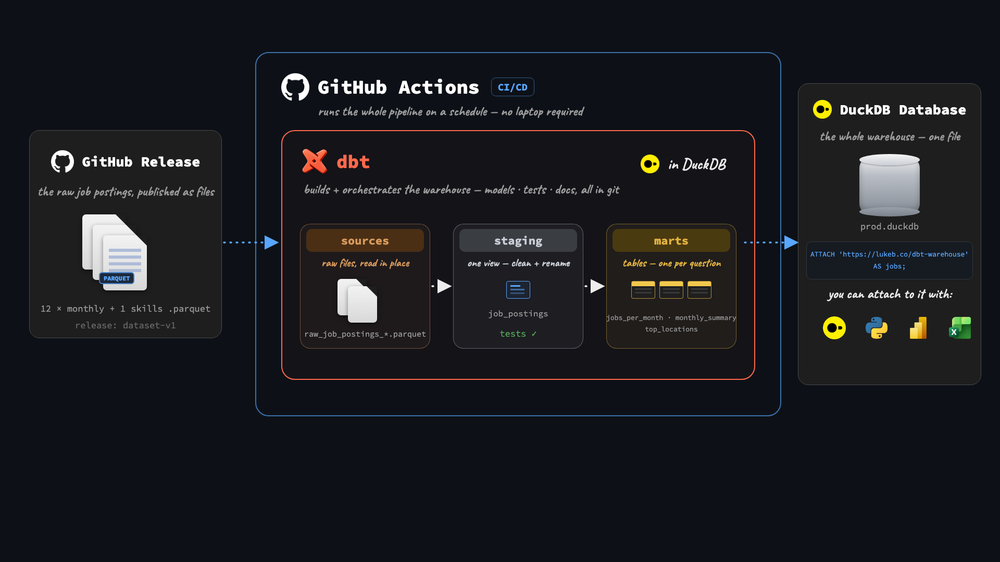
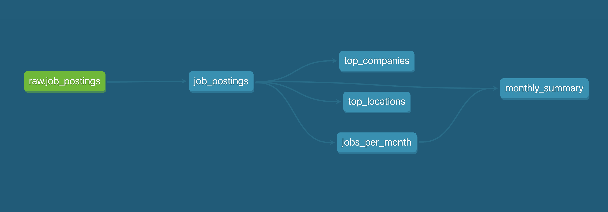

# Automated Job Postings Pipeline (v1) - dbt + DuckDB

[](https://github.com/lukebarousse/dbt_Analytics_Engineering_Course/actions/workflows/dbt_build.yml)
[](https://lukebarousse.github.io/dbt_Analytics_Engineering_Course/project1/)



A public dbt + DuckDB pipeline over ~692k real job postings, rebuilt and republished automatically on every push.

- Models the raw postings into tested, documented insight marts
- Publishes the docs site and the finished warehouse — open to anyone, no credentials
- Runs itself on GitHub Actions: every push and every Monday

| What I Built | How I Implemented | Where to Look |
| --- | --- | --- |
| **dbt pipeline** | sources → cleaned model → insight marts | [`analytics/models/`](analytics/models/) |
| **Data tests** | `unique` / `not_null` on every mart grain | [`schema.yml`](analytics/models/schema.yml) |
| **Hosted dbt docs** | lineage, descriptions, column tests | [Live docs site](https://lukebarousse.github.io/dbt_Analytics_Engineering_Course/project1/) |
| **Public CI** | build + test + publish on every push | [Actions workflow](https://github.com/lukebarousse/dbt_Analytics_Engineering_Course/actions/workflows/dbt_build.yml) |
| **Environments** | local `dev` vs CI `prod` targets | [`ci/profiles.yml`](ci/profiles.yml) |
| **Published warehouse** | one `ATTACH`, queryable by anyone | [Query it](#query-the-published-warehouse) |

---

## The dbt Pipeline



**dbt practices used**

| Practice | Implementation |
| --- | --- |
| Declared sources (no hardcoded paths in SQL) | [`sources.yml`](analytics/models/sources.yml) + `source('raw', 'job_postings')` |
| Model dependencies | `ref()` everywhere downstream; dbt resolves order and parallelism |
| Materializations | project default `table`; staging override to `view` |
| Data tests | `unique` / `not_null` on mart grains in [`schema.yml`](analytics/models/schema.yml) |
| Environments | local `dev` vs CI `prod` targets ([`ci/profiles.yml`](ci/profiles.yml)) |

`dbt build` compiles SQL, materializes models, and fails the run if any test fails — same command locally and in CI.

---

## Production

GitHub Actions runs the whole pipeline — no laptop required: [`.github/workflows/dbt_build.yml`](.github/workflows/dbt_build.yml)

| Trigger | What happens |
| --- | --- |
| Push to `main` | Full rebuild |
| Weekly (Monday) | Scheduled rebuild — pipeline stays fresh |
| Manual (`workflow_dispatch`) | Run button in the Actions UI |

On each run, Actions:

1. Installs deps with `uv`
2. Downloads raw parquet
3. Runs `dbt build --target prod`
4. Publishes `prod.duckdb` as a GitHub Release asset

The badge at the top of this README links to the latest runs.

---

## Query the published warehouse

No clone required. From a local DuckDB session:

```sql
ATTACH 'https://lukeb.co/dbt-warehouse' AS jobs;

SELECT * FROM jobs.main.top_companies;
SELECT * FROM jobs.main.monthly_summary;
```

> The short link is just a convenience — the database itself lives at the release asset URL, which works in `ATTACH` directly (use this form in your own README):
> `https://github.com/lukebarousse/dbt_Analytics_Engineering_Course/releases/download/warehouse/prod.duckdb`

---

## Docs

Docs are generated with `dbt docs generate` and published to GitHub Pages:

**→ [lukebarousse.github.io/dbt_Analytics_Engineering_Course/project1/](https://lukebarousse.github.io/dbt_Analytics_Engineering_Course/project1/)**

The site shows:

- The full **lineage graph** (sources → models → marts)
- **Model and column descriptions** from the YAML
- Which columns carry **tests**

---

## Run it yourself

```bash
uv sync
uv run python scripts/download_data.py
cd analytics && uv run dbt build
```

Optional docs locally:

```bash
uv run dbt docs generate
uv run dbt docs serve
```

---

## Project layout

```text
.
├── .github/workflows/dbt_build.yml   # public CI: build, test, publish
├── ci/profiles.yml                   # prod DuckDB target for Actions
├── data/                             # raw + warehouses (gitignored; CI regenerates)
├── docs/                             # dbt docs site (GitHub Pages)
├── analytics/
│   ├── dbt_project.yml
│   └── models/                       # sources, staging, marts, schema.yml
└── scripts/download_data.py          # fetch raw parquet before build
```

---

*Reference build for Project #1 of the [dbt for Data Analysts & Engineers course](https://www.lukebarousse.com) (lessons 1.01–2.03) — students build this repo themselves and compare against this version. Dataset: real job postings scraped daily.*
