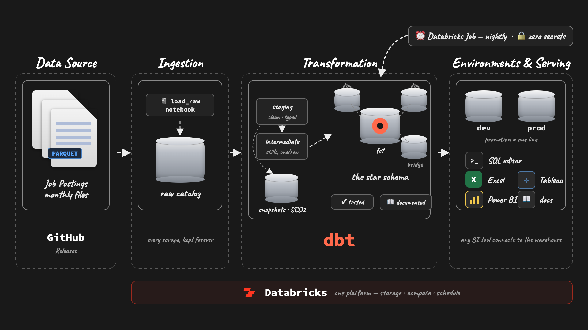
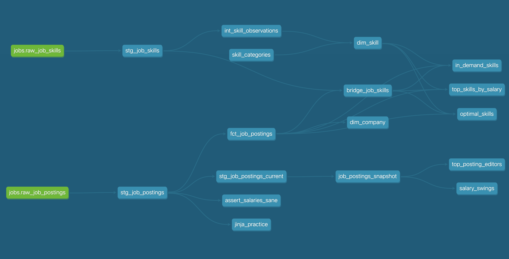

# Production Job-Postings Pipeline — dbt + Databricks

A production dbt pipeline on Databricks over **843,097 raw job-posting scrapes**: medallion layers shaped into a star schema, tested at every grain, with SCD2 salary history and a **scheduled job that runs with zero secrets**.



| What this demonstrates | Where to look |
| --- | --- |
| **Star schema** — fact + dims + bridge on a declared grain | [`analytics/models/marts/`](analytics/models/marts/) |
| **SCD2 snapshots** — a year of salary history, backfilled | [`analytics/snapshots/`](analytics/snapshots/) + [`scripts/`](scripts/) |
| **Incremental fact** — merge on `job_id`, only new days load | [`fct_job_postings.sql`](analytics/models/marts/fct_job_postings.sql) |
| **Macros** — a custom parser + an overridden built-in | [`analytics/macros/`](analytics/macros/) |
| **Tests** — generic, singular, and custom generic | [`analytics/tests/`](analytics/tests/) + the properties YAMLs |
| **Environments** — dev/prod as catalogs, one-line promotion | `~/.dbt/profiles.yml` targets |
| **Orchestration** — scheduled Databricks Job, zero secrets | Databricks → Jobs & Pipelines |
| **Analyses** — questions, kept next to the models that answer them | [`analytics/analyses/`](analytics/analyses/) |

---

## The pipeline

```
raw.jobs (Databricks catalog — 843,097 scrapes, loaded by notebook)
   │  scraper-flagged errors dropped at the door; 6,255 id-less rows cut with eyes open
   ▼
staging   views — typed, trimmed, benefits flags (jinja loop), salary parsed (macro)   685,695 rows
   ▼
intermediate   skills exploded to one observation per row
   ▼
marts   the star: fct_job_postings (491,140 jobs, deduped by QUALIFY — latest scrape wins)
        ⋈ dim_company · dim_skill (seed taxonomy) · bridge_job_skills (3.3M pairs)
   ▼
snapshots   job_postings_snapshot — SCD2 over 13 watched columns, 504,591 version rows
```

**dbt practices used**

| Practice | Implementation |
| --- | --- |
| Declared sources | `source('jobs', 'raw_job_postings')` — no hardcoded paths |
| Jinja beyond templating | benefits flags generated by a loop; one edit adds a flag |
| Custom macro | `parse_salary()` — one expression, written once, used four times |
| Overriding a built-in | `generate_schema_name` — schemas land where the folder says |
| Seeds | the skill taxonomy: version-controlled reference data |
| Test-driven cleaning | `not_null` surfaced 6,255 real id-less postings; dropped with eyes open, documented |
| Singular + custom tests | `assert_salaries_sane` caught a CA$1.2M typo the schema tests never would |
| SCD2 snapshots | `check` strategy on 13 content columns; `searched_at` dates the versions |
| Incremental | merge on `job_id`; `is_incremental()` + a `search_date` high-water filter |
| Environments | `catalog: dev` vs `catalog: prod` — promotion is a one-line diff |

---

## History the warehouse would have lost

The pipeline's marts keep each job's **latest** scrape. The snapshot keeps **every version**:

- **504,591** version rows across **491,140** jobs — **10,187** jobs with real change history
- **2,756** postings changed their salary between scrapes
- Analyses on top: [`top_posting_editors.sql`](analytics/analyses/top_posting_editors.sql) (Meta edits the most postings — 415) and [`salary_swings.sql`](analytics/analyses/salary_swings.sql) (a posting that went $60K → $1,000,000 — snapshots catch typos mid-edit)

---

## Production

- **Two targets, one profile**: every build lands in `dev` until it's promoted — `dbt build --target prod` writes the same schemas into the `prod` catalog
- **Scheduled Databricks Job** runs `dbt debug` → `dbt build` on cron, pulling the repo straight from GitHub
- **Zero secrets**: the job generates a temporary-credentials profile against the attached warehouse and revokes it after the run — no tokens in the repo, no CI secrets


<!-- screenshot: the job's green run with task timeline -->

---

## Docs

Structure, tests, and column descriptions were written along the way — the docs site is a rendering of work already done:

```bash
dbt docs generate && dbt docs serve                            # browse locally
dbt docs generate --static                                     # single-file site → docs/index.html
```

**→ Live docs: `<your-username>.github.io/<repo>`** — generated once and hosted on GitHub Pages. (P1's CI republishes docs on every push; this project's automation muscle lives in the Databricks job instead.)


<!-- screenshot: dbt docs → lineage graph, full DAG -->

`persist_docs` also pushes model and column comments into Unity Catalog, so the descriptions show up in the warehouse UI itself.

---

## How to run

```bash
uv sync && source .venv/bin/activate     # env
dbt debug                                # connection (profiles.yml holds your own host/token)
dbt build                                # models + tests + seed
dbt snapshot                             # one SCD2 pass (nightly in production)
```

Backfill a year of snapshot history in one query: paste [`scripts/backfill_job_postings_snapshot.sql`](scripts/backfill_job_postings_snapshot.sql) into the SQL editor — `dbt snapshot` takes over seamlessly afterwards.

---

*Reference build for Project #2 of the [dbt for Data Analysts & Engineers course](https://www.lukebarousse.com) (lessons 3.01–4.02) — students build this repo themselves and compare against this version. Dataset: real job postings scraped daily, July 2025 – June 2026.*
